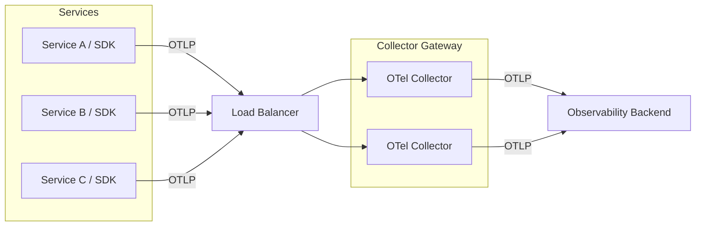

<!--
This template is for documenting a reference implementation: a real-world account of how an organization has adopted OpenTelemetry in production.

Unlike OTel Blueprints (which are challenge-oriented and prescriptive), reference implementations are evidence-based and narrative.
Their purpose is to share how a specific organization approached OTel adoption, what choices they made, and what they learned.

A good reference implementation tells a story. It explains:
- Who the organization is and how it is structured.
- What OpenTelemetry components they use and why.
- How their architecture and configuration works in practice.
- What worked, what didn't, and what they would do differently.

IMPORTANT: This template contains sections which may not be applicable to the environment in scope, or even possible for the author to fill in.
All sections are RECOMMENDED, helping the author drive the narrative, however the existence of any particular section is NOT REQUIRED.

Two types of markup are used to guide the author:

- Text in {curly brackets} denotes details that MUST be filled in by the author.
- Text in HTML comments (like this one) contains guidance that MUST NOT appear in the final document.

Authors MAY remove sections if they're not applicable to their implementation, or if they cannot share information pertaining to that section for any reason.
Authors MAY add additional sections, diagrams, or configuration examples.
Authors SHOULD keep descriptions factual and evidence-based, avoiding generic claims.
Authors MUST remove all {curly bracket placeholders} and HTML comment blocks before publishing.
Authors MAY include the names of the backend or vendor they used, but they MUST NOT include details related to why that backend was used, or the benefits/drawbacks of using it.
-->

## {Organization Name} Reference Implementation

<!--
Introduce your organization in a paragraph or two.
Explain what it does, who it serves, and any context that is relevant to understanding its observability challenges (e.g., open source product, decentralized architecture, non-profit, highly regulated industry).
This section sets the scene.
-->

{Brief description of your organization, its mission, and any architectural or operational context that is relevant to understanding its approach to observability.}

### Organizational structure

<!--
Describe how your engineering organization is structured, with a focus on who is responsible for observability.
Be specific: a single dedicated engineer looks very different from a single 20-person platform team, or a federated structure with multiple observability teams.
All shapes and sizes are valid, and the contrast is useful for readers in similar situations.

Include relevant information such as:
- Total engineering headcount (approximate is fine)
- Who owns observability tooling including SDK config, Collector Gateways, etc.
- Whether ownership is centralized or distributed across teams
- Who is responsible for instrumentation and ultimately data emissions
- How do observability teams interact with the rest of the organization
-->

{Description of your engineering organization structure, team size, and who is responsible for observability and OpenTelemetry infrastructure.}

### Environment and scale

<!--
Describe the environment where OpenTelemetry is deployed: infrastructure, runtimes, deployment model, and scale.
Include concrete numbers where possible.
These help readers assess how closely their situation matches yours.

Consider including:
- Infrastructure: cloud provider(s), on-premise, hybrid
- Orchestration: Kubernetes, VMs, serverless, etc.
- Languages and runtimes instrumented
- Number of services or applications
- Request volume, active user counts, or other scale indicators
- Observability backends in use
-->

| Dimension                | Details                                              |
|--------------------------|------------------------------------------------------|
| Infrastructure           | {e.g., AWS EKS, GCP GKE, on-premise VMs}             |
| Languages instrumented   | {e.g., Java, Python, Go, Ruby}                       |
| Number of services       | {e.g., ~200 microservices}                           |
| Scale                    | {e.g., ~10M requests/min, ~300K active users/day}    |
| Observability backend(s) | {e.g., SaaS vendor, self-hosted Jaeger + Prometheus} |

{Add any additional context about your environment that would help readers understand the
constraints or requirements that shaped your architecture.}

## Why OpenTelemetry

<!--
Explain the motivation behind adopting OpenTelemetry.
This is not a marketing pitch, it is an honest account of what drove the decision to adopt OpenTelemetry.

Consider:
- What was the situation before OpenTelemetry? (vendor-specific agents, no instrumentation, etc.)
- What problem or opportunity triggered the adoption?
- Why OpenTelemetry specifically, over alternatives?
- Were there organizational, technical, or strategic factors at play?
-->

{Explanation of why your organization chose OpenTelemetry, including the problem it solved and any alternatives considered.}

## OpenTelemetry components in use

<!--
List and briefly describe the OTel components you use, and how each fits into your architecture.
Focus on the role each component plays, not on how to configure it (that belongs in later sections).

Common components to cover (remove those that do not apply, add others as needed):
- OTel SDKs (which languages, manual vs. auto-instrumentation)
- OTel Collector (topology, role in the pipeline)
- OTel Operator (if running on Kubernetes)
- OTel Semantic Conventions (how you use them, any extensions or overrides)
- Any contrib or third-party components worth highlighting
-->

### SDKs and instrumentation

{Description of which OTel SDKs you use, in which languages, and whether you rely on manual instrumentation, auto-instrumentation, or a combination of both.
If relevant, explain how SDK configuration is managed across services.}

### OpenTelemetry Collector

{Description of how you use the OTel Collector: its role in the pipeline, deployment topology (e.g., per-node DaemonSet, per-namespace single instance, gateway cluster), and which signals it handles.}

### Other components

<!--
Include any other OTel components, integrations, or tooling worth mentioning.
e.g. OTel Operator, OpenTelemetry Demo, third-party receivers/exporters, etc.
Remove this section if it does not apply.
-->

{Description of any other OTel components or integrations in use.}

## Architecture

<!--
Provide an overview of your end-to-end observability architecture.
Diagrams are strongly encouraged.
If creating diagrams from scratch, we RECOMMEND using Mermaid.js with default styles for consistency with the rest of the documentation.
Alternatively, include a PNG or SVG diagram placed in the same directory as this file.

The goal is to give the reader a mental model of how data flows from your services to your observability backend(s).

Cover:
- How telemetry is emitted from services (SDK → Collector, or SDK → backend directly)
- How the Collector (if used) is deployed and how data flows through it
- Any processing, sampling, or enrichment that happens in the pipeline
- Where telemetry ends up (backend(s))
-->

{High-level description of your observability architecture. Replace or supplement with a diagram.}



<!--
Replace the diagram above with your actual architecture.
Add stages as appropriate: DaemonSet agents, Collector gateways, sampling tiers, etc.
-->

### Deployment and lifecycle management

<!--
Explain how OTel components are deployed and kept up to date.
This is particularly valuable for readers who are planning their own rollout.

Consider:
- How Collector instances are provisioned (Helm, Operator, Ansible, Terraform, etc.)
- How configuration changes are deployed (GitOps, CI/CD pipelines, manual, etc.)
- How you handle upgrades (frequency, process, breaking changes)
- Any tooling that helps manage the lifecycle (e.g., OTel Operator, Argo CD)
-->

{Explanation of how OpenTelemetry components are deployed, configured, and maintained in your environment.}

### Sampling and data governance

<!--
Include this section if sampling or cost management is a relevant concern for your architecture.
Remove it if it does not apply.

Explain:
- Whether you use head-based or tail-based sampling (or both)
- Sampling rates and policies
- How you ensure errors and high-value traces are always collected
- Any data transformation or filtering applied in the pipeline
-->

{Description of your sampling strategy and how you manage telemetry data volume.}

## Configuration

<!--
Share representative configuration examples. Real configurations are one of the most valuable parts of a reference implementation.
They bridge the gap between concepts and practice.

Include:
- OTel SDK configuration (environment variables, config files, or programmatic setup)
- Collector configuration (pipelines, processors, exporters)
- Any Kubernetes manifests (OpenTelemetryCollector CRDs, etc.)

Redact any secrets, API keys, or sensitive values. Use placeholders like ${ENV_VAR}.
Add comments to explain non-obvious choices.
-->

### SDK configuration

{Example SDK configuration or environment variable setup.
Remove this section if not applicable.}

```
{e.g., OTEL_SERVICE_NAME=my-service
OTEL_EXPORTER_OTLP_ENDPOINT=http://otel-collector:4317
OTEL_RESOURCE_ATTRIBUTES=deployment.environment=production}
```

### Collector configuration

{Example Collector configuration.
Include a brief explanation of the key decisions made.}

```yaml
# {Brief description of what this configuration does and any notable choices made}
receivers:
  otlp:
    protocols:
      grpc:
        endpoint: 0.0.0.0:4317
      http:
        endpoint: 0.0.0.0:4318

processors:
  batch: {}
  # {Add processors used and a brief comment on their purpose}

exporters:
  # {Add your exporter(s)}

service:
  pipelines:
    traces:
      receivers: [otlp]
      processors: [batch]
      exporters: []
    metrics:
      receivers: [otlp]
      processors: [batch]
      exporters: []
    logs:
      receivers: [otlp]
      processors: [batch]
      exporters: []
```

## Lessons and pain points

<!--
This is one of the most valuable sections for readers. Be honest and specific.

Consider:
- What was the hardest part of the adoption journey?
- Were there concepts that took time to understand?
- Were there components, features, or integrations that caused unexpected friction?
- Is there anything you would do differently if starting over?
- Any sharp edges in the ecosystem worth flagging (with constructive context)?
-->

{Honest account of the main difficulties encountered during OpenTelemetry adoption, including anything you would approach differently in retrospect.}

## Advice for others

<!--
Summarize the practical lessons from your experience as actionable advice.
Write this for a reader who is in a similar situation to where you were when you started.
Bullet points work well here.
-->

Based on {Organization Name}'s experience, a few lessons stand out:

- {e.g., Start simple: a single Collector instance per namespace is enough for most workloads}
- {e.g., Rely on semantic conventions from the start to avoid painful migration later}
- {e.g., Use the OTel Operator for lifecycle management — it removes significant operational toil}
- {Add additional advice specific to your context}

## What's next

<!--
Briefly describe how you plan to evolve your OpenTelemetry implementation.
This gives readers a sense of where the journey goes from here and what problems organizations at your stage are thinking about next.
-->

{Description of planned next steps for your OpenTelemetry adoption, such as expanding instrumentation coverage, migrating to new components, contributing upstream, or onboarding additional teams.}
