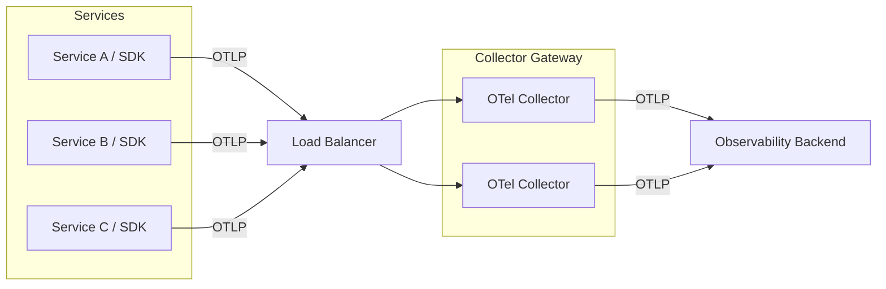

By [{Author Name}]({GitHub or web profile URL}) ({Organization Name}) | {Date}

_Before filling in this template, read the [Reference Implementation authoring guidelines](./reference-implementation-guidelines.md)._

## {Organization Name} Reference Implementation

{Brief description of your organization, its mission, and any architectural or operational context that is relevant to understanding its approach to observability.}

### Organizational structure

{Description of your engineering organization structure, team size, and who is responsible for observability and OpenTelemetry infrastructure.}

### Environment and scale

| Dimension                | Details                                              |
|--------------------------|------------------------------------------------------|
| Infrastructure           | {e.g., AWS EKS, GCP GKE, on-premise VMs}             |
| Languages instrumented   | {e.g., Java, Python, Go, Ruby}                       |
| Number of services       | {e.g., ~200 microservices}                           |
| Scale                    | {e.g., ~10M requests/min, ~300K active users/day}    |
| Observability backend(s) | {e.g., SaaS vendor, self-hosted Jaeger + Prometheus} |

{Add any additional context about your environment that would help readers understand the
constraints or requirements that shaped your architecture.}

## Why OpenTelemetry

{Explanation of why your organization chose OpenTelemetry, including the problem it solved and any alternatives considered.}

## OpenTelemetry components in use

### SDKs and instrumentation

{Description of which OTel SDKs you use, in which languages, and whether you rely on manual instrumentation, auto-instrumentation, or a combination of both.
If relevant, explain how SDK configuration is managed across services.}

### OpenTelemetry Collector

{Description of how you use the OTel Collector: its role in the pipeline, deployment topology (e.g., per-node DaemonSet, per-namespace single instance, gateway cluster), and which signals it handles.}

### Other components

{Description of any other OTel components or integrations in use.}

## Architecture

{High-level description of your observability architecture. Replace or supplement with a diagram.}


```mermaid
graph LR
  subgraph Services
    A1[Service A / SDK]
    A2[Service B / SDK]
    A3[Service C / SDK]
  end
  LB[Load Balancer]
  subgraph Collector Gateway
    C1[OTel Collector]
    C2[OTel Collector]
  end
  A1 -->|OTLP| LB
  A2 -->|OTLP| LB
  A3 -->|OTLP| LB
  LB --> C1
  LB --> C2
  C1 -->|OTLP| D[Observability Backend]
  C2 -->|OTLP| D
```

### Deployment and lifecycle management

{Explanation of how OpenTelemetry components are deployed, configured, and maintained in your environment.}

### Sampling and data governance

{Description of your sampling strategy and how you manage telemetry data volume.}

## Configuration

### SDK configuration

{Example SDK configuration or environment variable setup.
Remove this section if not applicable.}

```
{e.g., OTEL_SERVICE_NAME=my-service
OTEL_EXPORTER_OTLP_ENDPOINT=http://otel-collector:4317
OTEL_RESOURCE_ATTRIBUTES=deployment.environment=production}
```

### Collector configuration

{Example Collector configuration.
Include a brief explanation of the key decisions made.}

```yaml
# {Brief description of what this configuration does and any notable choices made}
receivers:
  otlp:
    protocols:
      grpc:
        endpoint: 0.0.0.0:4317
      http:
        endpoint: 0.0.0.0:4318

processors:
  batch: {}
  # {Add processors used and a brief comment on their purpose}

exporters:
  # {Add your exporter(s)}

service:
  pipelines:
    traces:
      receivers: [otlp]
      processors: [batch]
      exporters: []
    metrics:
      receivers: [otlp]
      processors: [batch]
      exporters: []
    logs:
      receivers: [otlp]
      processors: [batch]
      exporters: []
```

## Lessons and pain points

{Honest account of the main difficulties encountered during OpenTelemetry adoption, including anything you would approach differently in retrospect.}

## Advice for others

Based on {Organization Name}'s experience, a few lessons stand out:

- {e.g., Start simple: a single Collector instance per namespace is enough for most workloads}
- {e.g., Rely on semantic conventions from the start to avoid painful migration later}
- {e.g., Use the OTel Operator for lifecycle management — it removes significant operational toil}
- {Add additional advice specific to your context}

## What's next

{Description of planned next steps for your OpenTelemetry adoption, such as expanding instrumentation coverage, migrating to new components, contributing upstream, or onboarding additional teams.}
